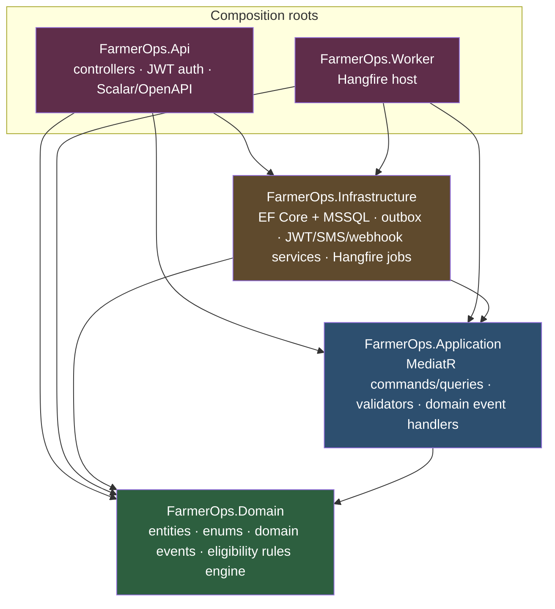
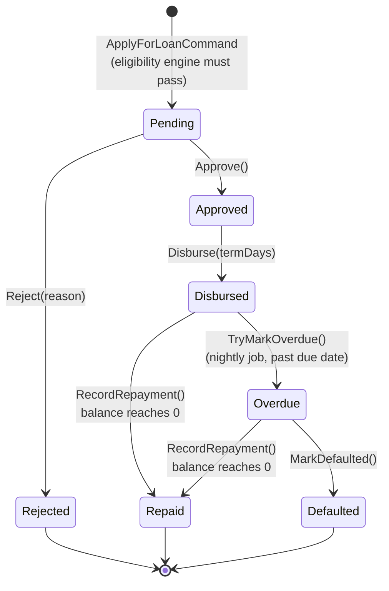
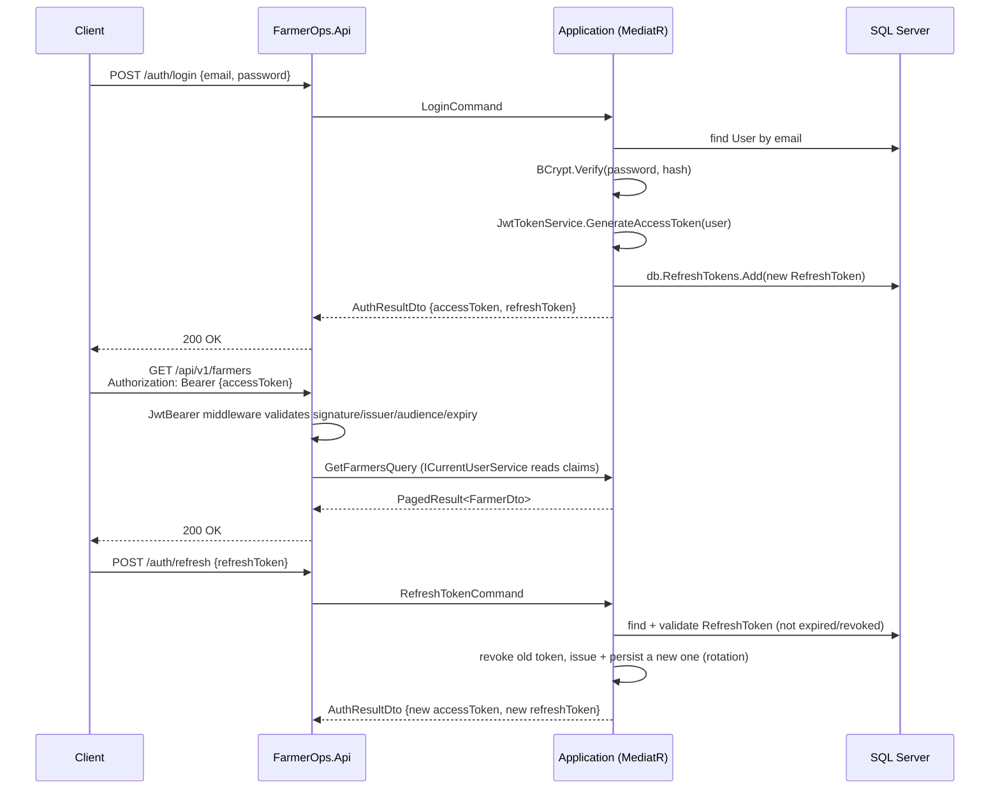
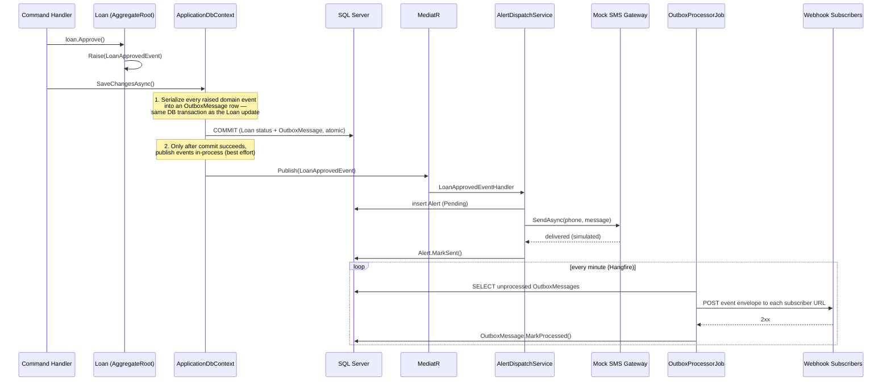

# Architecture

## 1. Layers and dependency direction

Clean Architecture: dependencies only ever point inward, toward `Domain`. `Api` and `Worker` are the two composition roots — they're the only projects that know about *every* other layer.

`Domain` has zero dependencies on the other layers — no EF Core, no ASP.NET Core, no MediatR implementation (only `MediatR.Contracts` for the `IRequest`/`INotification` marker interfaces). It's pure C#: entities enforce their own invariants through methods, never public setters.

`Application` defines the interfaces (`IApplicationDbContext`, `IJwtTokenService`, `ISmsGatewayService`, `IWebhookDispatcher`, `ICropRecommendationEngine`, ...) that `Infrastructure` implements — the Dependency Inversion that makes this "Clean."

## 2. Loan state machine

Every transition lives on the `Loan` aggregate itself (`Approve()`, `Reject()`, `Disburse()`, `RecordRepayment()`, `TryMarkOverdue()`, `MarkDefaulted()`); an invalid transition throws rather than silently corrupting state.

Each transition that matters operationally raises a domain event (`LoanApprovedEvent`, `LoanDisbursedEvent`, `LoanOverdueEvent`, `LoanRejectedEvent`, `LoanRepaymentRecordedEvent`) — see §4.

### Loan eligibility rules engine

`ApplyForLoanCommand` runs every registered `ILoanEligibilityRule` against the applicant before a `Loan` is even created (Specification pattern):

- `MinimumFarmSizeRule` — farm must be ≥ 0.25 acres
- `MaxOutstandingLoansRule` — at most one active (Pending/Approved/Disbursed/Overdue) loan at a time
- `NoDefaultedLoanHistoryRule` — no prior `Defaulted` loan on record
- `MaxRequestedAmountRule` — requested amount capped relative to farm size

All rules run to completion (no short-circuiting), so the caller — and `GET /api/v1/loans/eligibility` — gets a full report, not just the first failure.

## 3. Auth flow

**.NET 10 note:** the .NET 9 pattern for wiring a JWT bearer "Authorize" button into the generated OpenAPI document (an `OpenApiReference`-based security scheme) doesn't compile against .NET 10's updated `Microsoft.OpenApi` object model. `BearerSecuritySchemeTransformer` (`src/FarmerOps.Api/OpenApi/`) is the .NET 10 replacement — an `IOpenApiDocumentTransformer` that adds the Bearer scheme and requires it on every operation, which is what makes Scalar's Authorize button actually attach tokens to requests.

## 4. Domain events → transactional outbox → webhooks / alerts

The outbox write is atomic with the business change (true transactional outbox — a crash right after commit can never lose a webhook event). The in-process `Publish()` that drives the mock SMS alert is a secondary, best-effort side effect, not part of that same transaction — acceptable here since a missed SMS is far less costly than a lost integration event, and the alert itself is still durably recorded either way.

## 5. Background jobs (`FarmerOps.Worker`)

| Job | Schedule | What it does |
|---|---|---|
| `OverdueRepaymentCheckJob` | Nightly (02:00) | Finds `Disbursed` loans past `DueDateUtc`, calls `Loan.TryMarkOverdue()`, which raises `LoanOverdueEvent` → SMS alert |
| `OutboxProcessorJob` | Every minute | Drains unprocessed `OutboxMessage` rows to configured webhook subscribers |

Both are registered via `IRecurringJobManager` (not the static `RecurringJob` API — that relies on `JobStorage.Current`, which is only initialized automatically in ASP.NET Core hosts, not a plain `Microsoft.Extensions.Hosting` worker).
